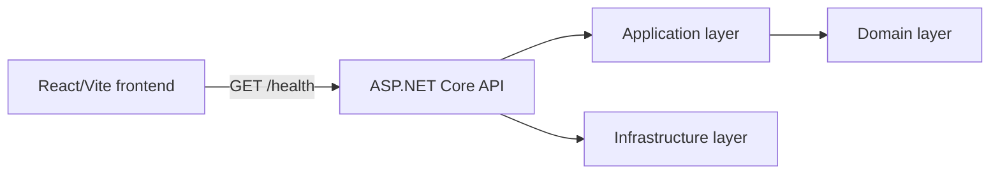
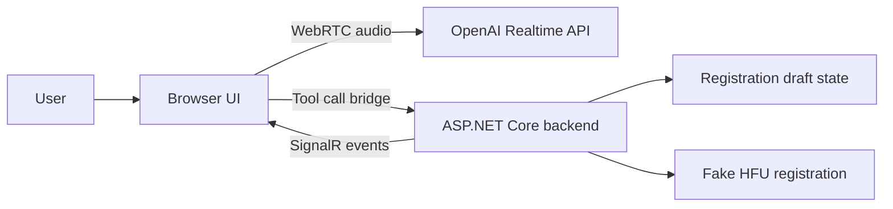

# Architecture

## Purpose

`Hfu.VoiceRegistration` is an external advertising PoC for HFU. It demonstrates the shape of a future voice-assisted registration system without integrating into the production HFU backend or storing real personal data.

## Current Runtime

The runtime surface still exposes only `GET /health`. The frontend calls that endpoint and displays loading, healthy, and error states.

## Backend Layers

- `Hfu.VoiceRegistration.Domain`: registration field state, draft model, user categories, conversation session concept, and completion validation. It has no external dependencies.
- `Hfu.VoiceRegistration.Application`: future use cases and contracts. It references Domain and exposes `AddApplication`.
- `Hfu.VoiceRegistration.Infrastructure`: future external adapters. It references Application and exposes `AddInfrastructure`.
- `Hfu.VoiceRegistration.Api`: ASP.NET Core host and HTTP endpoints. It references Application and Infrastructure.

`Program.cs` should remain composition-focused. New service registrations should live in layer-specific extension methods.

## Stage 2 Domain Boundary

The domain layer now owns the registration draft shape and completion eligibility rules. It can answer whether the current draft can complete registration without knowing anything about HTTP, OpenAI, frontend state, fake HFU registration, persistence, or SignalR.

Completion validation is intentionally conservative:

- required fields must be filled and not rejected or waiting for clarification;
- `phoneNumber`, `dateOfBirth`, `currentRegion`, `currentCity`, and `userCategory` must be confirmed;
- `email`, when provided, must be confirmed;
- optional fields may be missing or rejected;
- internally displaced users require `regionBeforeWar` and `displacedCertificateYear`;
- consent and final registration confirmation must be true.

## Future Voice Architecture

Future principle:

- Backend owns conversation and registration state.
- OpenAI owns speech-to-speech processing.
- Browser owns WebRTC audio transport and UI display.

The tool-call bridge should stay transport-aware but business-rule-light. Backend handlers remain the authority for validation, draft updates, and completion.

## Future SIP Readiness

Registration logic must not depend directly on browser WebRTC. A later SIP/IP telephony transport should be able to replace browser WebRTC by reusing the same backend application services and registration state.

## Security Boundaries

- Permanent OpenAI API keys stay only on the backend.
- Frontend receives only short-lived Realtime connection data in later stages.
- Backend must validate all field names, values, and statuses received from AI tool calls.
- The final registration DTO must be formed by backend state, not directly by the model.
- Real personal data must not be used in the PoC.

## Current Non-Goals

The current implementation does not include OpenAI, WebRTC, SignalR, fake HFU registration, in-memory session storage, databases, Redis, or production HFU integration.
