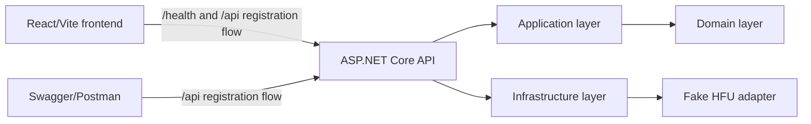
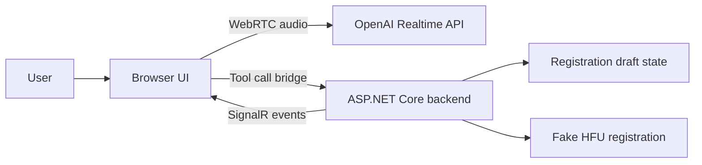

# Architecture

## Purpose

`Hfu.VoiceRegistration` is an external advertising PoC for HFU. It demonstrates the shape of a future voice-assisted registration system without integrating into the production HFU backend or storing real personal data.

## Current Runtime

The frontend now calls `GET /health` plus Stage 7 `/api` endpoints. The same backend flow remains testable through Swagger or Postman.

## Backend Layers

- `Hfu.VoiceRegistration.Domain`: registration field state, draft model, user categories, conversation session concept, and completion validation. It has no external dependencies.
- `Hfu.VoiceRegistration.Application`: use cases and contracts. It references Domain, exposes `AddApplication`, and owns backend registration tool handlers.
- `Hfu.VoiceRegistration.Infrastructure`: in-memory infrastructure adapters, including session storage and fake HFU registration. It references Application and exposes `AddInfrastructure`.
- `Hfu.VoiceRegistration.Api`: ASP.NET Core host and HTTP endpoints. It references Application and Infrastructure.

`Program.cs` should remain composition-focused. New service registrations should live in layer-specific extension methods.

## Stage 2 Domain Boundary

The domain layer now owns the registration draft shape and completion eligibility rules. It can answer whether the current draft can complete registration without knowing anything about HTTP, OpenAI, frontend state, fake HFU registration, persistence, or SignalR.

Completion validation is intentionally conservative:

- required fields must be filled and not rejected or waiting for clarification;
- `phoneNumber`, `dateOfBirth`, `currentRegion`, `currentCity`, and `userCategory` must be confirmed;
- `email`, when provided, must be confirmed;
- optional fields may be missing or rejected;
- internally displaced users require `regionBeforeWar` and `displacedCertificateYear`;
- consent and final registration confirmation must be true.

## Stage 3 Session Storage

`Hfu.VoiceRegistration.Application` defines `IConversationSessionStore` so later application use cases depend on a stable abstraction instead of an in-memory implementation.

`Hfu.VoiceRegistration.Infrastructure` provides the current PoC implementation:

- `InMemoryConversationSessionStore` stores sessions in a `ConcurrentDictionary`;
- each session has its own lock for serialized mutations;
- successful mutation updates advance `ConversationSession.Version`;
- session events stay inside the stored `ConversationSession`;
- unfinished inactive sessions expire after 30 minutes;
- completed sessions expire after 60 minutes;
- `ConversationSessionCleanupService` periodically removes expired sessions.

This stage intentionally avoids databases, Redis, EF Core, and production persistence.

## Stage 4 Backend Registration Tools

`Hfu.VoiceRegistration.Application` now exposes `IRegistrationToolService` as the application boundary for future HTTP and OpenAI tool-call adapters.

The service supports:

- updating one or more registration fields;
- confirming captured fields;
- marking fields as needing clarification;
- clearing fields back to missing;
- reading the authoritative registration state.

The service validates field names and values server-side before mutating state. Invalid tool input returns structured errors and leaves the stored `RegistrationDraft` unchanged. Successful mutations run through `IConversationSessionStore.UpdateAsync`, set the session active, advance session versioning through the existing event journal, and return a state snapshot with missing required fields, fields needing clarification, fields awaiting confirmation, and `RegistrationCanBeCompleted`.

Stage 4 deliberately did not expose HTTP endpoints, call OpenAI, or submit final registrations. The application-level `complete_registration` flow is implemented in Stage 6 and exposed over HTTP in Stage 7.

## Stage 5 Reference Data

`Hfu.VoiceRegistration.Application.ReferenceData` owns the current in-memory Ukrainian region catalog and `IRegionResolver`.

Canonical region display names are Ukrainian. The resolver accepts Ukrainian and Russian aliases, normalizes case and spacing, and never treats internal region IDs as aliases supplied by the model. `update_registration_fields` uses this resolver for `currentRegion` and `regionBeforeWar`.

Resolved regions are stored in the draft as Ukrainian canonical names plus a server-owned `ReferenceId`. Ambiguous or unknown regions are persisted as `NeedsClarification` with the raw value and clarification reason; the tool result returns `RegionAmbiguous` or `RegionNotFound` so a future voice assistant can ask a focused follow-up question.

Stage 7 exposes the region catalog through `GET /api/reference-data/regions`.

## Stage 6 Fake HFU Registration

`Hfu.VoiceRegistration.Application.RegistrationCompletion` owns the completion contracts and final DTO mapper. `complete_registration` accepts only `personalDataConsent` and `registrationConfirmed`; the final registration DTO is composed from the backend-owned `RegistrationDraft`.

The completion workflow:

- persists the final consent and confirmation flags;
- validates the complete draft with the conservative domain rules;
- returns `RegistrationCannotBeCompleted` when validation fails;
- calls `IFakeHfuRegistrationService` only for valid, not-yet-completed sessions;
- marks the conversation session completed and stores `RegistrationResult`;
- returns `RegistrationAlreadyCompleted` with the existing result and state on repeated completion attempts.

`Hfu.VoiceRegistration.Infrastructure.RegistrationCompletion` provides the current fake adapter. Demo registration IDs are generated in memory as `DEMO-{year}-{counter:000000}`. This stage does not call the real HFU backend.

## Stage 7 Backend HTTP API

`Hfu.VoiceRegistration.Api` exposes typed minimal API endpoints for conversation sessions, registration tools, fake completion, and reference data. Swagger/OpenAPI is enabled so the whole registration flow can be exercised without OpenAI or React UI.

HTTP endpoints are transport adapters over application services:

- session endpoints create, read, and abandon `ConversationSession` instances;
- registration tool endpoints call the matching `IRegistrationToolService` methods;
- `complete-registration` accepts only final consent and confirmation flags;
- reference data endpoint returns Ukrainian region names, server-owned IDs, and aliases.

Business tool failures remain application responses: the API returns `200 OK` with `RegistrationToolResult.Errors` and current state for cases like `RegistrationCannotBeCompleted`, `RegionNotFound`, or `RegistrationAlreadyCompleted`. HTTP-layer failures use Problem Details, including `404` for missing sessions and `409` for abandoning completed sessions.

## Stage 8 React UI Without Voice

`Hfu.VoiceRegistration.Web` is now a React/Vite operational demo UI over the Stage 7 HTTP API. It uses Russian labels while preserving Ukrainian canonical region values from reference data.

The UI supports:

- creating a conversation session;
- restoring a saved session from `localStorage`;
- loading Ukrainian region reference data;
- filling demo registration data;
- manually invoking update, confirm, clarification, clear, get-state, complete, and abandon actions;
- displaying server-owned registration state, field statuses, completion issues, structured tool errors, and fake HFU completion results.

The frontend does not own registration rules and does not submit final registration DTOs. It sends only typed Stage 7 requests and replaces its displayed state with backend responses.

## Stage 9 SignalR Live Updates

`Hfu.VoiceRegistration.Api` now hosts a SignalR hub at `/hubs/conversation`. Browser clients join one conversation-session group at a time through `JoinSession(Guid)` and may leave with `LeaveSession(Guid)`.

The hub publishes lightweight typed `ConversationEvent` messages after existing HTTP actions mutate state. SignalR payloads are intentionally not full registration DTOs: the React UI treats them as live notifications, appends them to a compact event list, and refreshes authoritative session state through `GET /api/conversation-sessions/{sessionId}`.

Stage 9 remains local and in-memory. It does not add OpenAI, WebRTC, an OpenAI tool-call bridge, Redis/backplane scale-out, persistence, auth, or production HFU integration.

## Future Voice Architecture

Future principle:

- Backend owns conversation and registration state.
- OpenAI owns speech-to-speech processing.
- Browser owns WebRTC audio transport and UI display.

The tool-call bridge should stay transport-aware but business-rule-light. Backend registration tools remain the authority for validation, draft updates, and completion eligibility.

## Future SIP Readiness

Registration logic must not depend directly on browser WebRTC. A later SIP/IP telephony transport should be able to replace browser WebRTC by reusing the same backend application services and registration state.

## Security Boundaries

- Permanent OpenAI API keys stay only on the backend.
- Frontend receives only short-lived Realtime connection data in later stages.
- Backend must validate all field names, values, and statuses received from AI tool calls.
- The final registration DTO must be formed by backend state, not directly by the model.
- Real personal data must not be used in the PoC.

## Current Non-Goals

The current implementation does not include OpenAI, WebRTC, the OpenAI tool-call bridge, databases, Redis/backplane scale-out, audio/transcript UI, or production HFU integration.
